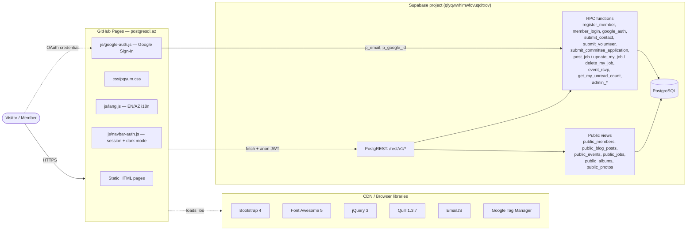

# Azerbaijan PostgreSQL User Group
The open-source community for PostgreSQL enthusiasts in Azerbaijan. 
This is the source code of AZERPUG's website www.postgresql.az
AZERPUG is officially recognized as a PostgreSQL User Group (https://www.postgresql.org/community/user-groups/)
## Our Mission
Azerbaijan PostgreSQL User Group exists to grow and strengthen the PostgreSQL community in Azerbaijan. We believe that knowledge is most powerful when it's shared freely, and that open-source technology is the foundation of innovation.

Our mission is to provide a platform where anyone — from curious beginners to seasoned database experts — can learn, share, and collaborate around PostgreSQL. We organize meetups, publish educational content, and connect professionals who work with the world's most advanced open-source relational database.

As an open community, our community has no hierarchy — every registered member is an equal participant. We welcome developers, DBAs, students, IT managers, and anyone interested in PostgreSQL to join us and contribute to the community.

## Community Values

- #### **Open Source**
We champion open-source software and the collaborative development model that makes PostgreSQL great.

- ### **Equality**
Every member has an equal voice. There is no hierarchy — we grow together as a flat, open community.

- #### **Knowledge Sharing**
We learn from each other through blog posts, meetups, workshops, and mentorship. Teaching is the best way to learn.

- #### **Inclusivity**
Everyone is welcome regardless of experience level, background, or profession. Curiosity is the only requirement.

## **Our History**
- 2018
Azerbaijan PostgreSQL User Group was founded in Baku as the first dedicated PostgreSQL user group in Azerbaijan, with the goal of building a local community around the world's most advanced open-source database.
- 2019
The community grew steadily with regular meetups and knowledge-sharing sessions among PostgreSQL professionals in Baku.
- 2020–2021
During the global pandemic, the community moved to online events and social media, expanding reach across Azerbaijan.
- 2022–2024
The community continued to grow, connecting with the global PostgreSQL community and establishing the postgresql.az website as a hub for Azerbaijani PostgreSQL users.
- 2026
The website was rebuilt with member registration, blog platform, and community features — powered by PostgreSQL via Supabase.

---

# Architecture

`postgresql.az` is a **static, multi-page website** hosted on **GitHub Pages**, paired with a **Supabase**-managed **PostgreSQL** backend that handles all dynamic data (members, blog posts, events, jobs, gallery, contact messages, committee applications). The browser talks directly to Supabase over HTTPS using the project's `anon` key — there is no custom application server.

## High-level diagram



## Frontend

A folder-per-feature layout where each route is an `index.html` that Apache / GitHub Pages serves at a clean URL (e.g. `/blogs/`, `/events/`, `/admin/`).

| Folder | Route | Purpose |
| --- | --- | --- |
| `index.html` | `/` | Homepage with hero + feature tiles |
| `about/`, `about/website/`, `about/privacypolicy/` | `/about/...` | Mission, history, tech stack, privacy |
| `registration/`, `login/`, `profile/` | `/registration/`, `/login/`, `/profile/` | Account creation, sign-in, profile + password change + mailbox |
| `members/` | `/members/` | Public member directory |
| `blog/`, `blogs/` | `/blogs/` | Blog index + rich-text/markdown editor (Quill) |
| `events/` | `/events/` | Events list + RSVP |
| `jobs/` | `/jobs/` | Job board (post / edit / delete own listings) |
| `gallery/` | `/gallery/` | Photo albums |
| `news/`, `feed/` | `/news/`, `/feed/` | News and RSS feed |
| `contact/` | `/contact/` | Contact form (writes to DB + EmailJS notification) |
| `committees/`, `committees/apply/` | `/committees/...` | Four governing committees + application form |
| `contribute/` | `/contribute/` | Volunteer signup |
| `coc/`, `faq/`, `resources/`, `sponsors/`, `community/`, `global-community/` | static info pages |
| `admin/` | `/admin/` | Admin panel (members, events, volunteer status, stats) — `Disallow`'d in `robots.txt` |
| `404.html` | — | Custom 404 |

### Shared client-side modules

All pages include the same two scripts at the bottom of `<body>`:

```html
<script src="/js/navbar-auth.js"></script>
<script src="/js/lang.js"></script>
```

| File | Lines | Responsibility |
| --- | --- | --- |
| `js/lang.js` | 809 | Translation dictionary (EN ↔ AZ), `data-i18n*` attribute scanner, language toggle button. Persists choice in `localStorage` (`azerpug_lang`) and dispatches a `langChanged` window event for page-specific text. |
| `js/navbar-auth.js` | 143 | Reads the session from `sessionStorage.azerpug_user`, injects auth-aware nav links (Sign In / My Profile / Logout / Admin), implements dark-mode toggle (`localStorage.azerpug_dark` + `data-theme="dark"`), and ships the dark-mode stylesheet inline. |
| `js/google-auth.js` | 68 | Decodes the Google ID token, calls the `google_auth` RPC, stores the returned member row as the session. |

### Styling

- `css/pgyum.css` — primary stylesheet; PostgreSQL-blue palette (`#336791`), Maven Pro + Open Sans typography (mirrors postgresql.org).
- Dark theme is delivered via JS-injected CSS variables under `[data-theme="dark"]`.
- Bootstrap 4 (CDN) supplies the grid + navbar; Font Awesome 5 supplies icons.

## Backend (Supabase / PostgreSQL)

Project ref: `qlyqwwhimwfcvuqdrxov` (URL `https://qlyqwwhimwfcvuqdrxov.supabase.co`). The frontend authenticates to PostgREST with the public **anon** key only.

### Read access — public views

For listings the client `GET`s read-only views directly via PostgREST:

```
GET /rest/v1/public_members
GET /rest/v1/public_blog_posts
GET /rest/v1/public_events
GET /rest/v1/public_jobs
GET /rest/v1/public_albums
GET /rest/v1/public_photos
GET /rest/v1/events             (admin context)
```

The `public_*` views project only safe columns (e.g. `public_members` excludes email, phone, password hash).

### Write access — RPC functions

All mutations go through `SECURITY DEFINER` Postgres functions, never raw `INSERT`s. This is what lets the site work safely with the anon key.

| RPC | Caller | Purpose |
| --- | --- | --- |
| `register_member` | `/registration/` | Create a new member account (password hashed client-side with SHA-256). |
| `member_login` | `/login/` | Verify credentials, return the member row. |
| `google_auth` | Google Sign-In flow | Find or create a member from a Google ID token payload. |
| `change_my_password` | `/profile/` | Verify old hash and rotate. |
| `submit_contact` | `/contact/` | Persist a contact message. |
| `submit_volunteer` | `/contribute/` | Persist a volunteer application. |
| `submit_committee_application` | `/committees/apply/` | Persist a committee application (schema in `sql/committees.sql`). |
| `post_job`, `update_my_job`, `delete_my_job` | `/jobs/` | Member-owned job board CRUD. |
| `event_rsvp` | `/events/` | RSVP to an event. |
| `get_my_unread_count` | navbar / mailbox | Inbox badge counter. |
| `admin_get_all_members`, `admin_get_stats`, `admin_insert_event`, `admin_delete_event`, `admin_update_volunteer_status` | `/admin/` | Admin-only operations, gated server-side by `is_admin`. |

### Auth model

- **Email + password** — passwords are SHA-256 hashed in the browser (`hashPassword`) before being sent to `register_member` / `member_login` / `change_my_password`. The plaintext never reaches the server.
- **Google Sign-In** — `js/google-auth.js` decodes the JWT from Google Identity Services and calls `google_auth(p_email, p_first_name, p_last_name, p_google_id)`.
- **Session** — the member row returned by either flow is stored in `sessionStorage.azerpug_user`. Admin sessions live in `sessionStorage.azerpug_admin`. There is no refresh-token machinery; the session ends with the tab.

## Internationalization (EN / AZ)

`js/lang.js` ships a single object `T` keyed by translation IDs (e.g. `nav.blog`, `home.subtitle`). Markup uses three attributes:

- `data-i18n="key"` — replaces `textContent`
- `data-i18n-html="key"` — replaces `innerHTML` (for translations containing markup)
- `data-i18n-placeholder="key"` — sets `placeholder` on form inputs

The toggle button in the navbar flips `localStorage.azerpug_lang` between `en` and `az`, re-runs `applyTranslations()`, and dispatches a `langChanged` event so individual pages can re-render dynamic content.

## Hosting & DNS

- **GitHub Pages** serves the repo at the apex domain — see `CNAME` (`postgresql.az`).
- `.htaccess` is a leftover from the previous Apache host and forces `https://postgresql.az` (HTTPS + non-www); it's inert under GitHub Pages, which redirects on its own.
- `robots.txt` allows everything except `/admin/`; `sitemap.xml` lists every public route with `changefreq` / `priority`.
- **Google Tag Manager** is the only analytics dependency.

## External dependencies

| Service | Used for | How loaded |
| --- | --- | --- |
| Supabase (`qlyqwwhimwfcvuqdrxov.supabase.co`) | PostgreSQL DB + PostgREST + RPC | `fetch()` with `apikey` header |
| Google Identity Services | OAuth sign-in | `accounts.google.com/gsi/client` |
| EmailJS (`cdn.jsdelivr.net/npm/@emailjs/...`) | Side-channel email notifications for contact / committee forms | CDN |
| Quill 1.3.7 (`cdn.quilljs.com`) | Rich-text editor on the blog | CDN |
| Bootstrap 4 (`maxcdn.bootstrapcdn.com`) | Grid + navbar | CDN |
| jQuery 3 slim (`code.jquery.com`) | Bootstrap dropdowns | CDN |
| Font Awesome 5 (`cdnjs.cloudflare.com`) | Icons | CDN |
| Google Tag Manager (`googletagmanager.com`) | Analytics | CDN |

## Repository layout

```
postgresql.az/
├── index.html              ← homepage
├── 404.html
├── CNAME                   ← postgresql.az
├── .htaccess               ← legacy HTTPS redirect
├── robots.txt
├── sitemap.xml
├── README.md               ← you are here
├── css/
│   └── pgyum.css           ← shared styles
├── js/
│   ├── lang.js             ← i18n (EN/AZ)
│   ├── navbar-auth.js      ← session + dark mode
│   └── google-auth.js      ← Google Sign-In
├── sql/
│   └── committees.sql      ← schema + RPC for committee applications
├── pict/                   ← images, logos, member photos
├── about/  admin/  blog/  blogs/  coc/  committees/  community/
├── contact/  contribute/  events/  faq/  gallery/
├── global-community/  jobs/  login/  members/  news/
├── profile/  registration/  resources/  sponsors/
└── feed/                   ← RSS
```

## Request flow examples

**Reading the blog** — `/blogs/` page → `GET /rest/v1/public_blog_posts?...` → PostgREST executes the view against PostgreSQL → JSON list rendered into cards.

**Registering a new member** — `/registration/` collects the form → `hashPassword(p)` (SHA-256) in the browser → `POST /rest/v1/rpc/register_member` with the hash → function inserts into `members` and returns the member row → row is saved to `sessionStorage.azerpug_user`.

**Posting a job** — `/jobs/` → user must be signed in (session check) → `POST /rest/v1/rpc/post_job` with `member_id` from session → function checks ownership and inserts.

**Toggling language** — click `#langToggleBtn` → `setLang('az')` writes `localStorage.azerpug_lang` → `applyTranslations()` rewrites every `[data-i18n*]` element → `langChanged` event lets pages re-render dynamic content.
